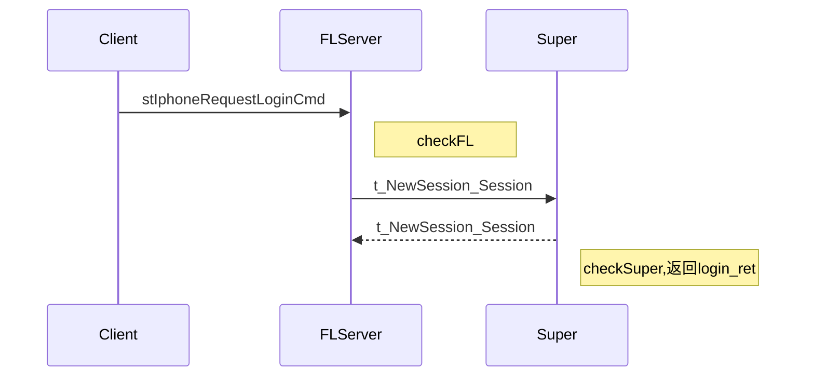
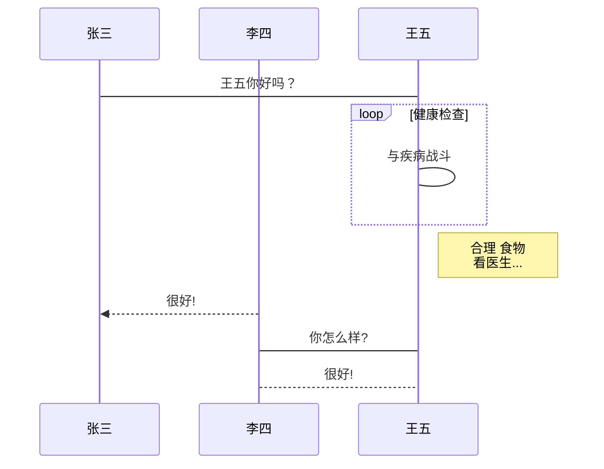

角色登录流程梳理




```
checkFL:
找到负载最小网关，且该网关在线人数小于1500人（配置）
```

```xml

<!--该服是否对外开启 影响Super killhup:SuperServer-->
<game_login_open_state>true</game_login_open_state>
<!--限制白名单登录 killhup:SuperServer-->
<specialloginstate>true</specialloginstate>
```

```
checkSuper:
1. 游戏不对外(game_login_open_state = false),只有超级账号,和白名单ip内机器人可以登录
2. 游戏对外,但限制了白名单登录，只有白名单账号（或超级账号），白名单ip内机器人可以登录
3. 游戏对外，没限制白名单登录
 * 判断账号是否被封禁
 * a
```

